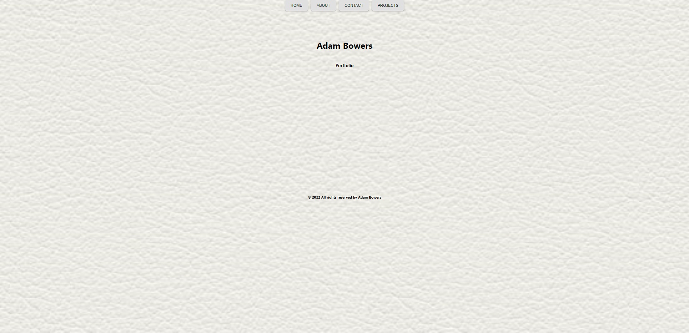

# react-portfolio

Working portfolio for Adam Bowers

## Description

This application is a personal portfolio websitre written using JavaScript, HTML, and React.

## Features

* Three sections including: about me, portfolio, and contact
* Display portfolio projects with links to working sites.
* Contact form which auto populates an email to site author
* Responsive layout suitable for mobile and desktop

## Installation

Run `npm i` to instal dependencies.  Run `npm start` to start.

Link to repository: https://github.com/adambowers09/react-portfolio

Link to herouk: https://git.heroku.com/react-portfolio-09.git

## Screenshot

