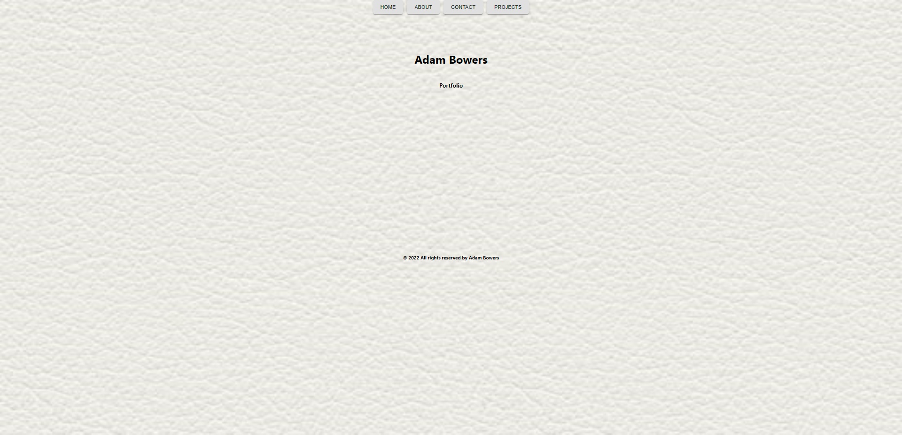

# MY PORTFOLIO

Working portfolio for Adam Bowers

## Description

This application is a personal portfolio website written using JavaScript, HTML, and React. 

## Installation

Fork the repo and run `npm i` to install dependencies and `npm start` to start.

## Links

[Link to GitHub Repo](https://github.com/adambowers09/react-portfolio)

[Link to deployed app](https://adambowers09.github.io/react-portfolio/)

## Screenshot

